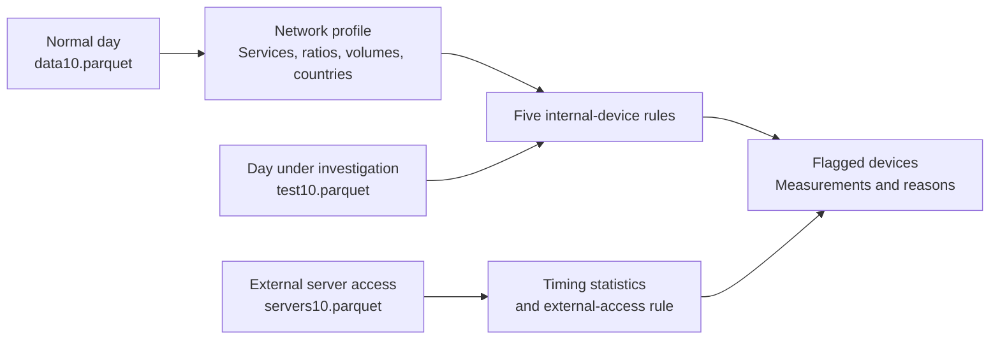

# Finding Suspicious Network Behavior in Firewall Logs

This project turns a day of normal network traffic into a baseline for finding suspicious activity. Using Python, pandas, and firewall flow records, it identifies unusual internal connections, upload-heavy HTTPS traffic, excessive DNS activity, changes in destination countries, and external clients with unusually regular timing.

I built it with **Gonçalo Cunha** for Security in Communications Networks at the University of Aveiro in 2025. The work covers traffic analysis, statistical baselines, six detection rules, and investigating the devices those rules flag. Everything runs locally in a Jupyter notebook using the datasets and GeoLite2 databases included here.

[Explore the notebook](analysis.ipynb) · [Setup and rule reference](DOCUMENTATION.md) · [Original project report](project_report.pdf)

## Why We Built It

A connection on port 443 tells you very little about whether a device is behaving normally. A workstation downloading a document and one sending large amounts of data outside the network can both use HTTPS. DNS is another everyday service whose volume and usage patterns can become interesting when a device starts behaving differently.

The project started with a corporate-network scenario: a SIEM had collected firewall logs, and we needed to define rules that could help identify compromised devices. We had one full day of traffic considered legitimate, another day that could contain anomalies, and a separate set of external connections to the company's public servers.

That made the first task understanding the network. Which machines normally talk to each other? How much do clients upload compared with what they download? How often do they use DNS? The detection rules came from those observations.

## Starting with a Normal Day

Each record contains a timestamp, source and destination IPv4 addresses, transport protocol, destination port, and uploaded and downloaded byte counts. There are no packet payloads or DNS query names. The analysis works with the shape of the traffic: who talks to whom, how much they exchange, and when connections occur.

The notebook defaults to dataset 10. Its clean day contains **964,901 flows from 197 internal source addresses** in `192.168.110.0/24`. Grouping private destination addresses by their services reveals six internal servers: four serving HTTPS and two serving DNS.

| Observation | Dataset 10 baseline |
| --- | --- |
| HTTPS traffic | 849,657 flows, or 88.1% of the total |
| DNS traffic | 115,244 flows, or 11.9% |
| Typical upload/download ratio | About 0.108: roughly nine bytes downloaded for every byte uploaded |
| HTTPS flows per DNS flow | 6.49–8.44 across the middle 90% of devices |
| External destination countries | 37, resolved through the bundled GeoLite2 database |

These measurements give the rules a reference point. An upload ratio of 1 would already be a substantial change in this network, even though equal uploads and downloads might be ordinary somewhere else.



The internal-device rules use the clean day as their baseline. The external-access rule derives its timing reference from the server-access dataset itself, which may contain anomalies.

## From General Alerts to Six Specific Rules

The first version used broad checks: new protocol/port combinations, percentage changes in traffic, unfamiliar countries and network operators, and deviations from each client's usual behavior. That implementation is preserved in [siemrules.py](siemrules.py), including a client report that can be filtered by address or violation type.

The later [notebook](analysis.ipynb) separates the analysis into six rules. Each asks a more specific question and reports the measurements behind its findings.

| Rule | What it looks for |
| --- | --- |
| Internal communication | Unusually high flow counts between internal IP pairs, or connections to internal destinations absent from the baseline server list |
| HTTPS upload imbalance | Devices whose uploaded/downloaded byte ratio on port 443 exceeds the baseline range |
| HTTPS/DNS balance | Devices with unusually many or unusually few DNS flows relative to HTTPS flows |
| DNS volume | Port-53 flow counts beyond the baseline maximum and its normal variation |
| External destinations | Countries absent from the clean day, or country-level flow counts that at least double |
| External access timing | Clients with unusually consistent intervals between flows, or unusually long average intervals |

For ratio-based rules, the notebook uses the baseline's 5th and 95th percentiles to describe a normal range. Other rules use mean flow counts, maximum counts, or standard deviations. The severity multipliers and tolerances are still chosen in code; the measured baseline supplies their reference values.

The earlier module and the notebook are separate implementations. The notebook contains its own detection functions and does not call `siemrules.py`.

## Following One Device Across Several Rules

One useful example is `192.168.110.21`. During the day under investigation, it generated **67,610 DNS flows**. The largest count for any device in the clean day was **1,655**.

That device stands out in three views of the same traffic:

- **Internal volume:** it sent 34,283 flows to one internal DNS server and 33,327 to the other. The baseline mean was about 242 flows per internal source/destination pair.
- **Protocol balance:** it made only 0.110 HTTPS flows per DNS flow, compared with a normal range of 6.49–8.44.
- **DNS volume:** its count exceeded the rule's critical threshold of twice the baseline maximum, or 3,310 flows.

The same overlap appears for `192.168.110.136` and `192.168.110.191`. Seeing the addresses recur makes them useful starting points for investigation. These rules describe related symptoms; the flow records alone cannot establish whether the underlying cause is DNS tunneling, command-and-control traffic, or something else.

The internal-connection rule also found a different pattern: four clients, ending in `.96`, `.137`, `.146`, and `.196`, communicated with each other in both directions. Their peer-to-peer connections formed a full mesh, outside the client-to-server pattern seen in the baseline. The rule flags these connections as possible lateral movement because the destinations were not known internal servers.

## When the Upload Direction Changes

The HTTPS rule groups port-443 traffic by source device and compares total uploaded bytes with total downloaded bytes. In the baseline, the upper end of the normal range is about **0.112**. For `192.168.110.122`, the test-day ratio is **10.820**: it uploads more than ten times what it downloads.

That difference is visible without decrypting a single connection. The notebook reports the ratio, traffic totals, severity, and deviation from the baseline so the finding can be inspected. Running this rule on dataset 10 flags three devices as critical and another five as moderate, including two close to the threshold.

The destination rule adds another view by mapping external IPs to countries through GeoLite2. It reports new countries and large increases in country-level flow counts, then lists the internal devices contributing to them. Geography helps explain a change in behavior; a newly contacted country alone does not establish malicious activity.

## Looking at Timing Instead of Just Volume

The external-access dataset calls for a different approach. For each client with at least ten flows, the notebook sorts timestamps and calculates the intervals between consecutive connections. It then measures the coefficient of variation:

```text
CV = standard deviation of the intervals / mean interval × 100
```

A smaller CV means the intervals are more consistent. The detector compares each client's value with the lower end of the observed population, and separately checks for unusually long average intervals.

Three external clients stood out while contacting `200.0.0.12`. Their mean intervals were about **8.5–8.6 seconds**, with CV values around **23.6%**, compared with a 5th-percentile reference of about **369%**. Together, they generated **11,877 flows**. Their similar timing and shared address prefix made them candidates for closer inspection.

Regular timing can indicate automation. Determining whether that automation is harmful would require more context than these records provide.

## What the Results Mean

The [project report](project_report.pdf) brings the findings together into an assessment of **19 internal and three external addresses**. That is the report's selected set of suspicious devices. The notebook returns broader sets in its HTTPS and geographic checks, and the combined threat-score table was assembled in the report rather than generated by a scoring engine in the code. The [technical documentation](DOCUMENTATION.md) records the results of rerunning the notebook.

The project gave us a way to move from nearly a million baseline records to specific devices and understandable reasons for investigating them. It also exposed how much a rule depends on its assumptions: stable device addresses, comparable observation periods, and a clean day that represents ordinary activity.

Several days of baseline traffic and labelled evaluation data would let us measure false positives and missed detections, and check whether thresholds still make sense as normal usage changes. The current repository demonstrates offline rule development and investigation; it does not include live collection or automated response.

## Exploring the Repository

| File or directory | Contents |
| --- | --- |
| [analysis.ipynb](analysis.ipynb) | Network profiling, statistical baselines, and the six detection rules |
| [siemrules.py](siemrules.py) | Earlier general-purpose rules, ASN analysis, and filterable client reports |
| [datasets/](datasets/) | Baseline, test, and external-server Parquet files for datasets 2, 8, and 10 |
| [databases/](databases/) | Local GeoLite2 Country and ASN databases |
| [requirements.txt](requirements.txt) | Pinned Python analysis dependencies |
| [DOCUMENTATION.md](DOCUMENTATION.md) | Environment setup, data format, exact thresholds, and implementation notes |

To run the analysis, follow the [setup instructions](DOCUMENTATION.md#setup) and open `analysis.ipynb`. The [original brief](project-proposal.pdf), [project report](project_report.pdf), and [enhancement report](enhancement_report.pdf) preserve the assignment and the reasoning behind the two versions.
